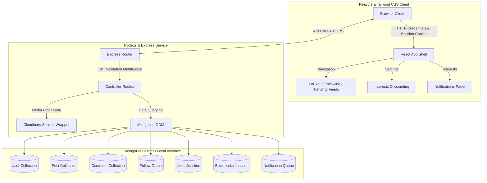
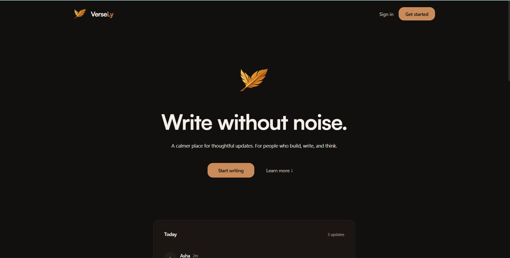
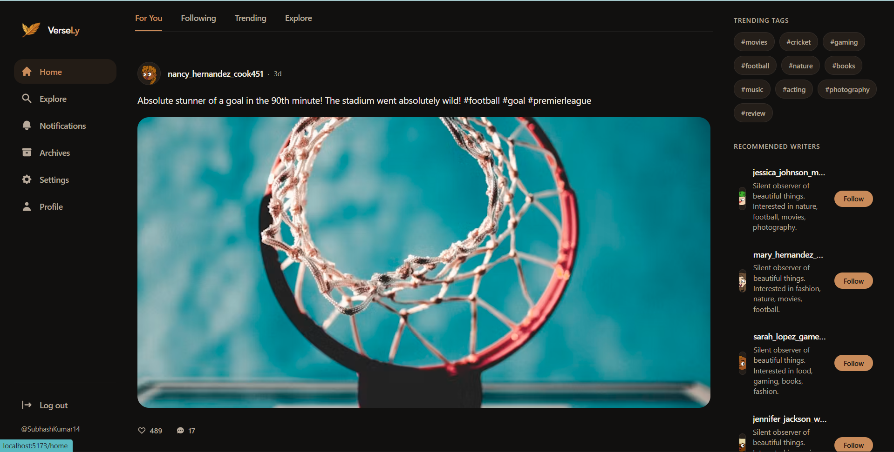
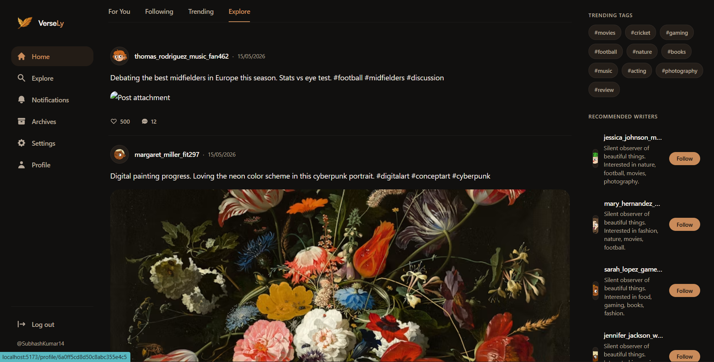
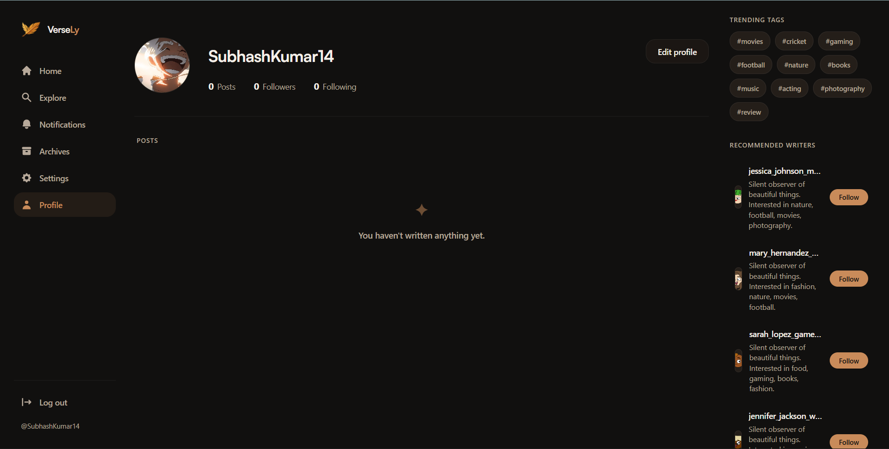
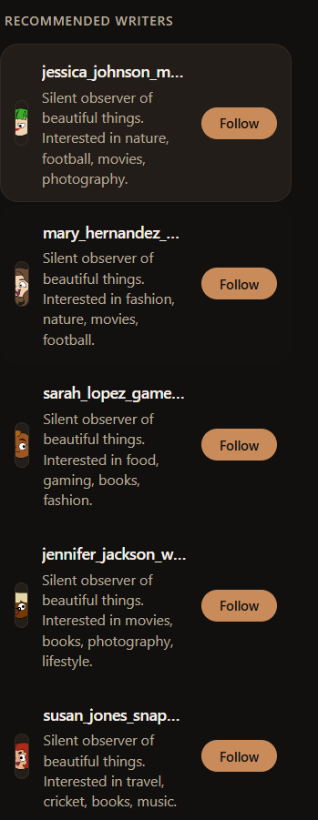
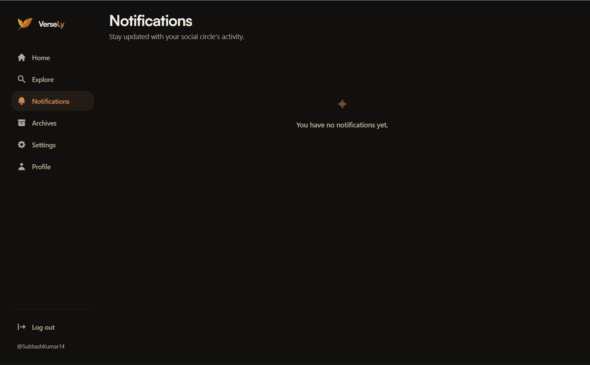
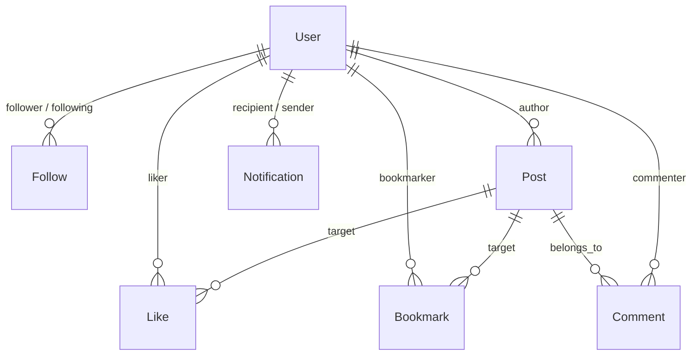

# 🌌 Verse — AI-Powered Social Media Discovery Platform

Verse is a modern full-stack social media ecosystem inspired by Twitter/X, Instagram Explore, Threads, and TikTok recommendation graphs. Built on the MERN stack, it features a scalable MongoDB architecture, personalized content feeds, an interactive interest-based onboarding system, and realistic social graph simulation.

---

## 🚀 Live Demo
* **Frontend Application**: [Verse-App](https://verse-app-beta.vercel.app)


---

## 🎨 System Architecture Overview



---

## 📸 Screenshots

| Home Feed | For You Feed | Explore Feed |
| :---: | :---: | :---: |
|  |  |  |

| User Profile | Trending & Recommendations | Notifications Panel |
| :---: | :---: | :---: |
|  |  |  |

---

## 🌟 Key Features

### 🔐 Authentication & Session Security
* **JWT Cookie Auth**: Secure httpOnly cookie session tracking with automatic state restore.
* **Onboarding Flow**: Guided interest picker (15 genres) that establishes the user's initial interests graph.
* **Custom Profile Management**: Cloudinary-backed profile picture and cover photo uploads, editable bios, and counts.
* **Granular Profile Privacy**: Options for `public`, `private`, or `follower-only` accounts to manage visibility.

### ✍️ Social Interactions
* **Micro-Posting**: Support for text-only, text-and-image, and image-only posts.
* **Normalized Graph Operations**: Follow/unfollow, like/unlike, and bookmark/unbookmark features running on dedicated scalability tables.
* **Threading**: Chronological comments for deep, readable discussion trees.
* **Real-time Alerts**: Automated activity notifications for likes, comments, and new followers.

### 📡 The Feed Engine
* **Following Feed**: A chronological list of posts created by users you follow, including your own posts.
* **For You Feed**: Personalized recommendations sorted by a hybrid network-relevance score.
* **Trending Feed**: Global engagement ranking with a time-decay algorithm.
* **Explore Feed**: Discovery panel highlighting high-performing posts from creators you do *not* follow, sorted by category.

---

## 🧠 Recommendation & Feed Ranking Algorithms

Verse utilizes real-time scoring formulas to deliver high-quality, personalized feeds.

### 1. Global "Trending" Algorithm
To surface active discussions globally, the system uses an engagement-heavy formula inspired by the Hacker News decay mechanism:

$$\text{Score} = (\text{likesCount} \times 3) + (\text{commentsCount} \times 5) + (\text{bookmarksCount} \times 4) + \frac{200}{(\text{hoursElapsed} + 2)^{1.2}}$$

This balances total engagement against post age to maintain fresh, active discussion.

### 2. Personalized "For You" Algorithm
The personalization engine evaluates and ranks posts based on user interest profiles and network associations:

$$\text{Personalized Score} = \frac{\text{network boost} + \text{interest boost} + \text{engagement score} + 1}{(\text{hoursElapsed} + 1.5)^{1.0}}$$

* **Network Boost**: Adds **+50** points if the post's author is followed by the current user.
* **Interest Boost**: Adds up to **+50** points based on the current user's profile interests match: `interestScore` (0.0 to 1.0) multiplied by 50.
* **Engagement Score**: Sums weighted interactions: $(\text{likes} \times 3) + (\text{comments} \times 5) + (\text{bookmarks} \times 4)$.
* **Decency Decay**: Penalizes older posts to keep content fresh.

---

## 💾 Scalable Database Schema Design

Unlike traditional relational schemas embedded inside user or post documents (which cause MongoDB's 16MB document boundary issues at scale), Verse utilizes a **normalized, high-scale architecture**:



### Collection Model Overview
* **`User`**: Stores identity details, profile counters, and an `interestScores` Map (e.g. `{ football: 0.9, food: 0.2 }`).
* **`Post`**: Stores authorship, text/image metadata, categories, hashtags, and cached counters (`likesCount`, `commentsCount`, `bookmarksCount`).
* **`Follow`**: Stores directed social graph edges: `{ follower: ObjectId, following: ObjectId }`.
* **`Like`**: Stores user-post interaction pairs: `{ user: ObjectId, post: ObjectId }`.
* **`Bookmark`**: Stores user-post saved pairs: `{ user: ObjectId, post: ObjectId }`.
* **`Notification`**: Activity queue: `{ recipient, sender, type: 'like'|'comment'|'follow', post }`.

---

## 🗄️ Dataset System & Seeding

Verse includes a high-fidelity synthetic seeder (`backend/scripts/seed.js`) that constructs a realistic community ecosystem of **1,500 active accounts** across multiple genres:

> [!NOTE]
> **Genre Segments**: `movies`, `photography`, `art`, `food`, `lifestyle`, `travel`, `football`, `cricket`, `fitness`, `technology`, `gaming`, `books`, `fashion`, `music`, and `nature`.

### 👥 User Graph Demographics
* **Lurkers (45%)**: Set up profile, browse categories, read posts, make occasional likes/bookmarks.
* **Casual Users (35%)**: Post occasionally, follow 20–30 users, write comments.
* **Creators (15%)**: Write 5–10 posts within their core genres, maintain high follower counts.
* **Influencers (5%)**: Maintain massive follow graphs, post high-impact content, draw massive engagement.

---

## ⚙️ Environment Variables

Create a `.env` file inside the `backend/` directory:

```env
PORT=5000
NODE_ENV=development

# Database Connection Mode Selection
# Set to 'local' to connect to local MongoDB, or 'cluster' to connect to MongoDB Atlas
MONGO_CONNECTION_MODE=cluster

# Connection URIs
MONGO_URI=mongodb+srv://<username>:<password>@cluster0.mongodb.net/verse
MONGO_URI_LOCAL=mongodb://127.0.0.1:27017/verse-app

# Session Security
JWT_SECRET=your_jwt_signing_secret_here
JWT_EXPIRES_IN=1d

# Client Origin
CORS_ORIGIN=http://localhost:5173

# Cloudinary CDN Configuration
CLOUDINARY_CLOUD_NAME=your_cloudinary_cloud_name
CLOUDINARY_API_KEY=your_cloudinary_api_key
CLOUDINARY_API_SECRET=your_cloudinary_api_secret
CLOUDINARY_FOLDER=Verse_App
```

---

## 🛠️ Local Setup & Installation

### 1. Clone the Repository
```bash
git clone https://github.com/SubhashKumar14/Verse-App.git
cd Verse-App
```

### 2. Install Project Dependencies
```bash
# Install backend dependencies
cd backend
npm install

# Install frontend dependencies
cd ../frontend
npm install
```

### 3. Populating the Database (Seeding)
Run the seeder tool to clear old structures and write clean, safe, recommendation-ready synthetic data. 

> [!TIP]
> You can choose to seed your local database or cloud cluster by choosing environment configuration or using CLI flags:

```bash
# Seed to your local database (Forces local mode)
cd backend
node scripts/seed.js --local

# Seed to your MongoDB Atlas cluster (Forces cluster mode)
node scripts/seed.js --cluster
```

### 4. Running the Development Servers
Open two separate terminal shells:

**Backend Server**:
```bash
cd backend
npm run dev
```

**Frontend Client**:
```bash
cd frontend
npm run dev
```

---

## 📡 API Endpoint Reference

### 1. Feed & Discover Endpoints
| HTTP Method | Route | Description |
| :--- | :--- | :--- |
| `GET` | `/api/posts/for-you` | Fetch personalized feed ranked by user interests and follow graph |
| `GET` | `/api/posts/following` | Fetch chronological feed of posts from followed accounts |
| `GET` | `/api/posts/trending` | Fetch global feed sorted by time-decay engagement formula |
| `GET` | `/api/posts/explore` | Fetch popular posts categorised by user's non-followed topics |
| `GET` | `/api/posts/trending-tags` | Retrieve dynamic list of hashtags appearing in recent posts |
| `GET` | `/api/posts/recommended-users` | Fetch account follow suggestions based on interest correlation |

### 2. Social Interactions
| HTTP Method | Route | Description |
| :--- | :--- | :--- |
| `POST` | `/api/posts` | Create a text/media post |
| `POST` | `/api/posts/:id/like` | Toggle post like state (updates cached counter) |
| `POST` | `/api/posts/:id/bookmark` | Toggle post bookmark state (updates cached counter) |
| `POST` | `/api/users/:id/follow` | Toggle follow status of another account |

### 3. User Settings & Onboarding
| HTTP Method | Route | Description |
| :--- | :--- | :--- |
| `POST` | `/api/users/onboarding-interests` | Save initial interest map on onboarding completion |
| `GET` | `/api/users/:username` | Fetch profile information |

### 4. Notifications Panel
| HTTP Method | Route | Description |
| :--- | :--- | :--- |
| `GET` | `/api/notifications` | Get social alerts feed |
| `PATCH`| `/api/notifications/read-all` | Mark all alerts as read |

---

## ☁️ Media Delivery Optimization
Verse links media uploads directly to **Cloudinary** and optimizes browser loading speeds:
* **Quality Auto (`q_auto`)**: Compresses images dynamically based on network bandwidth without visible quality loss.
* **Format Auto (`f_auto`)**: Delivers modern formats (like WebP or AVIF) depending on the browser support footprint.
* **Transformation Scaling**: Crops and constrains image layouts using Cloudinary parameter strings before delivering assets, minimizing database storage to flat URL paths.

---

## 🧠 MongoDB Queries Optimization
* **Compound Indexes**: Applied on `{ follower: 1, following: 1 }` and `{ post: 1, user: 1 }` for rapid validation.
* **Aggregations**: Used throughout the recommendation feeds, leveraging Mongoose `$lookup` and `$facet` stages for performance.
* **Text Indexing**: Enabled on `User` (`username`, `bio`) and `Post` (`content`, `hashtags`, `category`) to support performant keyword discovery.

---

## 🔮 Scalability & Future Upgrade Paths
* **Redis Caching**: Planned implementation for caching user interest graphs and trending feed aggregations.
* **WebSockets / Socket.io**: Real-time push updates for likes, comments, and direct messaging channels.
* **Atlas Vector Search**: Prepare the codebase to process unstructured texts into AI vector embeddings to support semantic recommendation indexing.

---


## 📄 License
This project is licensed under the **MIT License** - see the LICENSE file for details.
