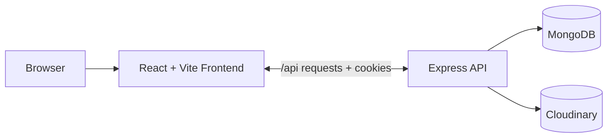

# VerseLy

VerseLy is a MERN stack social writing app built for short-form, text-first publishing. The product is designed around calm reading, fast posting, thoughtful profiles, and a warm editorial interface rather than engagement bait or noisy social mechanics.

## What The App Does

- Public landing page with clear calls to action for sign in and sign up.
- Cookie-based authentication with automatic session restore.
- Protected home feed with text posts, image posts, likes, comments, and user profiles.
- Follow and unfollow support for a simple social graph.
- Search, archives, and settings screens for managing the writing experience.
- Profile photo uploads and post image uploads stored in Cloudinary.
- Responsive desktop and mobile layout with a shared shell, side rails, and bottom navigation.

## Architecture



The repository is split into two applications:

- `backend/` owns routes, services, middleware, models, file handling, and the MongoDB connection.
- `frontend/` owns routing, shared state, presentation components, form flows, and the client-side shell.

## Tech Stack

| Layer | Technologies |
|---|---|
| Frontend | React 19, Vite, React Router, Axios, react-hook-form, react-hot-toast, React Icons, Tailwind CSS |
| Backend | Node.js, Express, Mongoose, JSON Web Tokens, cookie-parser, Multer, Cloudinary |
| Storage | MongoDB for application data, Cloudinary for images |

## Core Capabilities

### Authentication And Session Handling

- Register and login are handled through the backend auth service.
- Login and register set an httpOnly token cookie.
- The frontend restores the session on load by calling the authenticated user endpoint.
- Logout clears the cookie and resets the client auth state.

### Writing And Social Flow

- Create posts with text, optional image attachments, and character feedback.
- Like and unlike posts.
- Comment on posts in chronological thread order.
- Follow and unfollow users.
- Search people by username or email.

### Archives And Recovery

- Posts and comments use soft delete instead of hard delete.
- Archived posts and comments can be restored from the Archives screen.

### Profile And Media

- Users can update username, bio, and profile picture.
- Posts can include an uploaded image.
- All images are stored in Cloudinary, not in a local uploads folder.
- Avatars fall back to initials when no photo is available.

### Interface And Experience

- Desktop layout uses a three-column shell with a left rail, feed, and right sidebar.
- Mobile layout uses a slim top bar and bottom navigation.
- Theme preference is persisted in localStorage and applied through the HTML `data-theme` attribute.
- Form handling uses react-hook-form on auth, composer, and settings flows.

## How It Is Structured

### Backend

- `backend/server.js` bootstraps Express, CORS, cookie parsing, JSON parsing, route mounting, and global error handling.
- `backend/api/` contains the HTTP route modules for auth, users, posts, and comments.
- `backend/services/` contains business logic such as auth and media uploads.
- `backend/middleware/` contains protection and upload middleware.
- `backend/models/` contains the MongoDB schemas and model rules.
- `backend/config/` contains database and Cloudinary configuration.

### Frontend

- `frontend/src/App.jsx` defines the route tree and shell composition.
- `frontend/src/context/` stores auth and theme state.
- `frontend/src/services/` centralizes API access.
- `frontend/src/components/` contains layout, post, user, and common UI components.
- `frontend/src/pages/` contains the landing page, auth pages, feed, profile, search, archives, and settings screens.

## Project Structure

```text
Verse-App/
  backend/
    api/
    config/
    middleware/
    models/
    services/
    server.js
    .env
  frontend/
    src/
      components/
      context/
      pages/
      services/
      styles/
    vite.config.js
    index.html
```

## Local Setup

### Prerequisites

- Node.js 18 or newer.
- MongoDB running locally.
- A Cloudinary account for image uploads.

### Install Dependencies

This repository does not use a root package.json, so install dependencies in each app folder.

```bash
cd backend
npm install

cd ../frontend
npm install
```

### Backend Environment

Create `backend/.env` with your local and Cloudinary values:

```env
PORT=5000
NODE_ENV=development

MONGO_URI=mongodb://localhost:27017/verse-app

JWT_SECRET=your_jwt_secret_here
JWT_EXPIRES_IN=1d

CORS_ORIGIN=http://localhost:5173

CLOUDINARY_CLOUD_NAME=your_cloud_name_here
CLOUDINARY_API_KEY=your_api_key_here
CLOUDINARY_API_SECRET=your_api_secret_here
CLOUDINARY_FOLDER=verse-app
```

### Run The App In Development

Open two terminals.

Backend:

```bash
cd backend
node server.js
```

If you want auto-reload, use:

```bash
cd backend
npx nodemon server.js
```

Frontend:

```bash
cd frontend
npm run dev
```

The Vite dev server proxies `/api` to `http://localhost:5000`, so the client can talk to the backend without browser CORS issues during local development.

### Build For Production

```bash
cd frontend
npm run build
```

## Backend API Surface

All routes are mounted under `/api`.

| Area | Routes |
|---|---|
| Auth | `POST /api/common/register`, `POST /api/common/login`, `POST /api/common/logout`, `GET /api/common/user` |
| Users | `GET /api/users/search?q=...`, `GET /api/users/:id`, `PUT /api/users/:id`, `POST /api/users/:id/follow`, `GET /api/users/:id/followers`, `GET /api/users/:id/following` |
| Posts | `GET /api/posts`, `GET /api/posts/user/:id`, `GET /api/posts/:id`, `POST /api/posts`, `PATCH /api/posts/:id`, `POST /api/posts/:id/like`, `GET /api/posts/archives/user`, `PATCH /api/posts/:id/restore` |
| Comments | `GET /api/comments/:postId`, `POST /api/comments/:postId`, `PATCH /api/comments/:id`, `GET /api/comments/archives/user`, `PATCH /api/comments/:id/restore` |

## Data Model Summary

- `User` stores username, email, hashed password, bio, profile photo, followers, following, and post counts.
- `Post` stores author, content, optional image, likes, archive state, and comment count.
- `Comment` stores post reference, author, text, and archive state.
- Soft delete is used for posts and comments so archived content can be restored later.

## Deployment Notes

- The frontend expects an API path on `/api`. In development, Vite handles that proxy.
- The backend uses credentialed CORS and httpOnly cookies, so production deployments should keep the frontend and backend origins aligned and use HTTPS.
- If the frontend and backend are deployed on separate domains, make sure the API proxy or reverse proxy is configured correctly and `CORS_ORIGIN` matches the frontend origin.

## Current Notes

- Images are stored in Cloudinary. The old local uploads folder is no longer part of the active app flow.
- The backend currently starts with `node server.js` or `npx nodemon server.js` from the `backend/` directory.
- Account deletion is still a UI placeholder.

## Screens In The App

- Landing
- Login
- Register
- Home feed
- Profile
- Post detail
- Search
- Archives
- Settings

## Summary

VerseLy is a cleanly separated MERN application with a service-driven backend, a component-driven frontend, cookie-based authentication, Cloudinary media storage, and a responsive reading-and-writing experience built around calm, text-first publishing.