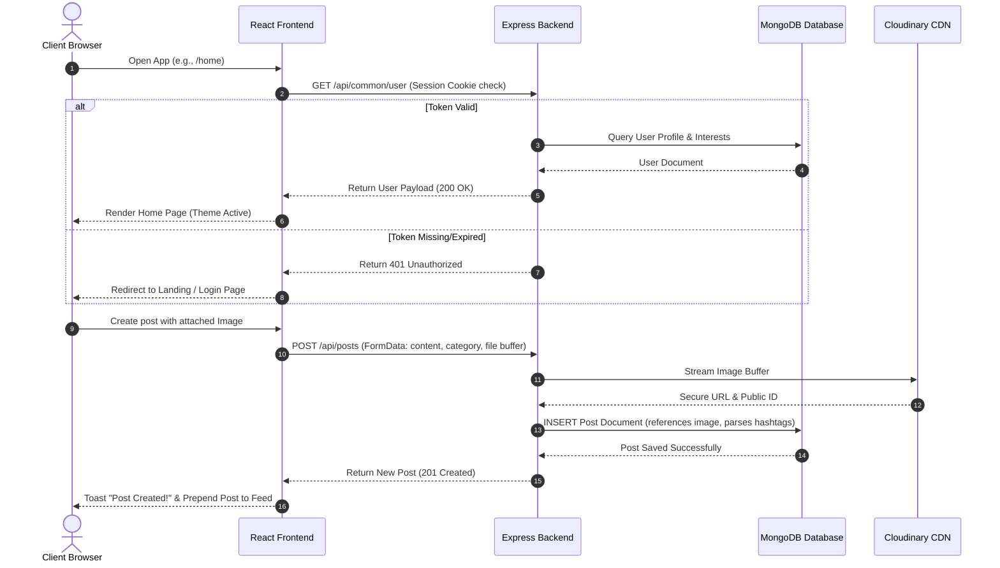

<!--
viva_prep_guide.md

Long-form viva/interview preparation notes for this project: architecture,
design decisions, algorithms, and talking points for explaining the system.
-->

# 🌌 Verse — Full-Stack AI-Powered Social Media Discovery Platform
## 🎓 Complete Viva & Technical Interview Preparation Guide

This guide is designed to prepare you exhaustively for any possible university viva, system design interview, or software engineering defense. It breaks down the complete architecture, tech stack decisions, frontend/backend implementations, database normalization models, security mechanisms, and feed-ranking algorithms of the **Verse** application.

---

## 📂 Table of Contents
1. **[SECTION 1: Project Overview](#section-1--project-overview)**
2. **[SECTION 2: Tech Stack Deep Dive](#section-2--tech-stack-deep-dive)**
3. **[SECTION 3: Frontend Deep Dive](#section-3--frontend-deep-dive)**
4. **[SECTION 4: Backend Deep Dive](#section-4--backend-deep-dive)**
5. **[SECTION 5: Database Schema & DBMS Overview](#section-5--database-schema--dbms-overview)**
6. **[SECTION 6: Authentication & Security Architecture](#section-6--authentication--security-architecture)**
7. **[SECTION 7: System Design & Request Lifecycles](#section-7--system-design--request-lifecycles)**
8. **[SECTION 8: Feature-Wise Technical Breakdowns](#section-8--feature-wise-technical-breakdowns)**

---

## SECTION 1 — PROJECT OVERVIEW

### 1. Explain the project in simple terms.
**Verse** is a modern social media discovery platform similar to a hybrid of Twitter/X, Instagram, Threads, and TikTok. It is a place where users can create micro-posts (text and images), follow other accounts, comment on posts, like, and bookmark their favorite content. 

Unlike traditional networks that only show posts chronologically, Verse uses a **personalized recommendation engine** and global engagement formulas to curate feeds (like the **"For You"** and **"Trending"** pages). It also features an interactive interest-based onboarding system where users pick their favorite genres (e.g., technology, sports, photography) when they register, immediately customizing their feed.

### 2. Explain the real-world problem solved.
Modern social networks suffer from three massive engineering and user-experience issues:
1. **The "Cold Start" Problem**: When a new user registers on a platform, they see a blank feed because they do not follow anyone yet. This leads to immediate churn. Verse solves this with an interest-based onboarding picker and a collaborative content recommendation engine that populates their "For You" page immediately.
2. **Network Lock-in / Echo Chambers**: Chronological "Following" feeds isolate users. Verse introduces a global "Explore" and time-decayed "Trending" engine to surface high-performing posts outside a user's immediate social circle.
3. **The MDB 16MB Document Boundary Issue**: Relational social graphs stored as nested arrays (e.g., storing a list of user IDs in `user.followers` or `post.likes` inside user/post documents) fail at scale because MongoDB limits a single document size to 16MB. Verse solves this by employing a fully normalized **junction-collection schema** (separate `Follow`, `Like`, `Bookmark`, and `Comment` models) which scales horizontally.

### 3. Explain target users.
* **Content Creators**: People looking for dynamic, interest-based categorizations to find target audiences without fighting traditional platform monopolies.
* **Discovery Seekers**: Social media users who are tired of echo chambers and want to explore micro-content across genres (football, gaming, travel, tech, art, nature).
* **Privacy-Conscious Users**: Users who want granular profile privacy settings (`public`, `private`, `followers-only`) to control who can view their social graph and micro-posts.

### 4. Explain major features.
* **Interactive Onboarding**: Guided multi-genre selection (15 genres) that sets up the user's initial interests graph.
* **Smart feeds**:
  * *For You*: Collaborative matching based on dot-product user interest mapping, network boosts, and time-decay.
  * *Trending*: Global popularity calculated using a Hacker News-style time-decay coefficient.
  * *Following*: Direct, real-time chronological feeds from followed users.
  * *Explore*: Engaging content from creators the user does *not* follow, categorized by genre.
* **Granular Profile Management**: Custom editable profile fields, statistics, and secure Cloudinary-optimized profile pictures and cover photos.
* **Micro-Posting with Automated Hashtag Extraction**: Creates posts containing text, images, or both. Categorizes and extracts hashtags using regex.
* **Normalized Social Interactions**: Scalable, high-speed follow/unfollow, like/unlike, and bookmarking toggles utilizing Mongoose hooks to keep cached counters synced.
* **Threading**: Multi-level chronological comments with soft delete capabilities.
* **System Alerts / Notifications**: Real-time action logging for likes, comments, and new followers.
* **User Archives**: Safe environment allowing users to view, manage, and restore soft-deleted posts or comments.

### 5. Explain why specific technologies were chosen.
* **React (v19) & Vite**: Ultra-fast build times, hot module reloading (HMR), declarative UI rendering, and a state-of-the-art virtual DOM architecture.
* **Tailwind CSS (v4)**: High-performance utility-first styling with integrated CSS custom properties for instant, beautiful theme transitions.
* **Express & Node.js**: High concurrency, event-driven non-blocking I/O loop, and lightweight routing ideal for building real-time micro-post APIs.
* **MongoDB & Mongoose**: Flexible, JSON-like document modeling matching JavaScript objects seamlessly. Mongoose aggregates make building high-performance feed scoring pipelines straightforward.
* **Cloudinary**: Offloads raw image hosting, compression, and format optimization (e.g., WebP/AVIF delivery via `q_auto,f_auto`) from the application server, saving storage costs.
* **Multer**: Memory storage handling to pipe incoming multipart form buffers directly to Cloudinary streams without writing to node disks.

### 6. Explain complete workflow from user opening app to final interaction.


---

### 7. Explain architecture in beginner + intermediate + advanced level.
* **Beginner Level**:
  It is a website that has two halves: the **Frontend** (what the user sees, built in React) and the **Backend** (the server, built in Node.js/Express). The backend acts as a chef in a kitchen: the frontend makes an order (API Request), the backend processes it, grabs the raw ingredients from the fridge (MongoDB Database), packages it up, and serves it back to the client as JSON data.
* **Intermediate Level**:
  It follows a **Client-Server Architecture** running on the **MERN (MongoDB, Express, React, Node.js) Stack**. The client app manages views, routing, local theme states, and uses Axios with credentials to fetch data. The backend server acts as a RESTful API layer. It uses a token-in-cookie model (`httpOnly` JWT sessions) to identify who is logged in. Models are mapped using **Mongoose ODM** schemas, executing CRUD queries and enforcing schema validation. Media files are offloaded to **Cloudinary** using **Multer memory storage** streams.
* **Advanced Level**:
  It is an **event-driven, normalized high-scale monolith** built to bypass database bottlenecks. Rather than using embedded arrays (which trigger write-lock and document-limit degradation), the database is structured as a **highly normalized entity-relationship graph** with dedicated junction tables (`Like`, `Bookmark`, `Follow`) paired with composite text and compound indexes to keep query execution times under $O(log N)$. The "For You" page is powered by a **dynamic hybrid aggregation pipeline** matching real-time interest arrays, network indicators, and interactive coefficients with exponential decay factors. The system maintains linear scaling through denormalized cached counters (`postsCount`, `followersCount`, `likesCount`) synced via transaction-safe Mongoose post-save and post-delete middleware.

---

### 8. Give short project explanations for your viva:
* **30-Second Pitch (Elevator Pitch)**:
  > "Verse is a modern full-stack social media discovery platform inspired by Threads and X. It is built using the MERN stack with a React/Vite client and a Node/Express backend. Key features include highly personalized feeds powered by real-time interest correlation and time-decay algorithms, a guided multi-genre onboarding system, and a highly scalable normalized database schema that prevents MongoDB document boundary issues by offloading social graphs into dedicated junction indexes."
* **1-Minute Explanation**:
  > "My project is Verse, a MERN-stack social platform that solves the cold-start and echo-chamber issues found in traditional social media. When users register, they complete an interactive genre onboarding that constructs their initial interest graph. This interest graph is used by our backend recommendation engine, which utilizes a MongoDB aggregation pipeline to calculate a personalized 'For You' score. The score is a combination of user category weights, social network indicators (whether you follow the author), and engagement counts—all processed through an exponential time-decay formula. The app offloads image uploads directly to Cloudinary using streaming memory buffers via Multer, features strict JWT httpOnly session security, and supports dark/light themes with warm-tinted custom transitions."
* **3-Minute Deep Dive**:
  > "Verse is a production-ready, full-stack micro-posting ecosystem designed around database scalability and real-time feed curation. The frontend is built on React 19, Vite, and Tailwind CSS v4, implementing a custom Coffee Cream design system with seamless OS-level media query hooks. On the backend, we run an Express.js server linked to MongoDB via Mongoose. 
  > 
  > A major design achievement in Verse is its highly normalized database schema. To support millions of users, we rejected the easy but non-scalable approach of storing lists of followers, likes, and bookmarks directly inside User and Post documents, which triggers MongoDB's 16MB document size limit. Instead, we normalized these associations into separate Follow, Like, and Bookmark collections. To prevent slow queries, we created compound indexes like `{ follower: 1, following: 1 }` and used Mongoose database middleware to cache and sync counts on parent documents.
  > 
  > Our feed engine has three custom pipelines: 
  > 1. 'Following', which is a chronological index.
  > 2. 'Trending', which ranks global activity using a Hacker News-style decay formula to keep content fresh.
  > 3. 'For You', which uses MongoDB aggregates to perform dot-product calculations on interests and network boost factors, divided by post age. 
  > 
  > Security is enforced using secure httpOnly JWT cookies, protecting routes, while all media uploads use streaming memory buffers to bypass local server disk writes, maintaining a completely stateless, horizontally scalable API tier."

---

## SECTION 2 — TECH STACK DEEP DIVE

### MERN Stack Breakdown

```
┌────────────────────────────────────────────────────────┐
│                        CLIENT                          │
│   React (v19) ── Tailwind CSS (v4) ── Axios ── Router  │
└───────────────────────────┬────────────────────────────┘
                            │ (httpOnly JWT Session Cookie)
                            ▼
┌────────────────────────────────────────────────────────┐
│                      API SERVER                        │
│   Node.js ── Express.js ── Multer (Memory Buffer)       │
└─────────────┬──────────────────────────────┬───────────┘
              │ (Mongoose Aggregation)       │ (Stream Upload)
              ▼                              ▼
┌───────────────────────────┐  ┌─────────────────────────┐
│         DATABASE          │  │        MEDIA CDN        │
│    MongoDB Enterprise     │  │   Cloudinary Service    │
└───────────────────────────┘  └─────────────────────────┘
```

---

### 1. React (v19) & Vite (Frontend Core)
* **What it is**: An open-source JavaScript library for building user interfaces (React) bundled with a next-generation frontend tool that is extremely fast (Vite).
* **Why used**: React handles the complex, interactive state of social actions (e.g., live liking, following toggles, theme switching) instantly. Vite replaces slow Webpack bundling with native ES Modules (ESM) and utilizes Hot Module Replacement (HMR) to make development incredibly fast.
* **Alternatives**: Angular, Vue.js, Svelte, Next.js.
* **Advantages**: Virtual DOM minimizes browser repaints; vast NPM package library; clean component-based structure; Vite completes development builds in milliseconds.
* **Disadvantages**: React is a library, not a full framework (requires separate routing/state libraries); high learning curve for hook transitions and context state patterns.
* **Internal Working**: React constructs an in-memory **Virtual DOM**. When a component's state changes, React runs a "reconciliation" process, compares the Virtual DOM with the real DOM using a diffing algorithm, and updates *only* the specific HTML nodes that changed.
* **Common Viva Questions**:
  * **Q: What is the difference between Virtual DOM and Real DOM?**
    * *A: The real DOM updates the entire HTML tree on change, which is slow. The virtual DOM is a lightweight JavaScript representation of the DOM. React diffs it and batches only the necessary changes to the real DOM, making rendering extremely fast.*
  * **Q: Why does Vite build faster than Webpack?**
    * *A: Webpack bundles the entire app from scratch before serving it. Vite leverages native browser ES Modules and loads code on-demand, transpile-caching files with Esbuild (written in Go) which is 10-100x faster than JS-based bundlers.*

---

### 2. Express.js & Node.js (Backend REST API)
* **What it is**: Node.js is a runtime that lets you run JavaScript on the server. Express is a minimalist web framework for Node.js to handle routes and middleware.
* **Why used**: Social media backends must handle thousands of concurrent requests (fetching feeds, likes, comments). Node's asynchronous event-driven loop handles high concurrency efficiently without blocking threads.
* **Alternatives**: Django (Python), Spring Boot (Java), Ruby on Rails, NestJS.
* **Advantages**: Lightweight, single language (JS) across the entire stack, extremely fast execution via Chrome's V8 engine, easily integrates middleware (cookie-parser, CORS).
* **Disadvantages**: Single-threaded (not suitable for heavy CPU-bound math/video encoding); code can easily spiral into "callback hell" if async/await is not managed cleanly.
* **Internal Working**: Node.js uses a **Single-Threaded Event Loop** and a thread pool (libuv). When an asynchronous request (like fetching a post from MongoDB) enters the server, Node delegates the database query to the system thread pool and continues handling other users. When MongoDB returns the post, the database callback is placed in the event queue and processed, allowing the server to handle millions of connections on a single thread.
* **Common Viva Questions**:
  * **Q: How does Node.js handle concurrency if it is single-threaded?**
    * *A: It uses an asynchronous non-blocking event-driven architecture. Slow I/O tasks are delegated to the operating system's thread pool, allowing the single main execution thread to process incoming requests continuously without waiting.*
  * **Q: What is middleware in Express?**
    * *A: A function that runs between receiving a request and sending a response. It has access to `req`, `res`, and the `next` function. It is used for tasks like parsing cookies, checking auth, or handling errors.*

---

### 3. MongoDB & Mongoose (Database & ODM)
* **What it is**: MongoDB is a NoSQL, document-based database. Mongoose is an Object Data Modeling (ODM) library that provides validation and mapping between MongoDB and JavaScript objects.
* **Why used**: Social posts are unstructured, rich text files (often including arrays of hashtags and maps of interests). Storing them as JSON-like documents matches MongoDB's schema perfectly. Mongoose makes writing complex aggregation pipelines (which power our feeds) highly readable and structured.
* **Alternatives**: PostgreSQL, MySQL, Redis.
* **Advantages**: Schema flexibility, scalable sharding, rapid read/write speeds, rich aggregation frameworks.
* **Disadvantages**: Lacks strict ACID transactions by default (though supported now), uses more memory than SQL databases, and relational lookups ($lookup) can become slow without proper indexing.
* **Internal Working**: MongoDB stores data in binary JSON formats called **BSON**. It utilizes collections instead of tables, and documents instead of rows. Mongoose runs on top, translating JavaScript schemas into BSON commands, enforcing validation, and managing connection pools.
* **Common Viva Questions**:
  * **Q: Why choose MongoDB over MySQL/SQL?**
    * *A: Social media data is naturally semi-structured (variable fields, nested objects). MongoDB's document model matches this format perfectly without requiring complex table joins. It also provides easy scaling for horizontal growth.*
  * **Q: What is the purpose of Mongoose virtuals?**
    * *A: Virtuals are document properties that you can get and set but do not persist to MongoDB (e.g., getting a full image URL from a saved public ID). They are calculated dynamically on query.*

---

### 4. JWT Cookie-Based Authentication
* **What it is**: JSON Web Token (JWT) is an open standard that allows secure transmission of claims between client and server as a JSON object.
* **Why used**: Standard sessions require the server to store active sessions in database memory. JWT is **stateless**; the user's ID is encoded inside the token, signed by the server's secret, and stored in a secure `httpOnly` cookie. The server can authenticate the user simply by verifying the token's cryptographic signature without querying the database, making the API stateless and highly scalable.
* **Alternatives**: Session-IDs stored in Redis, OAuth 2.0 (Firebase/Auth0).
* **Advantages**: Stateless, zero database lookups for session verification, immune to CSRF if paired with SameSite cookies, cannot be read by malicious frontend scripts.
* **Disadvantages**: Tokens cannot be easily invalidated before expiration (revocation requires building a blacklist, e.g., in Redis); cookie sizes are larger than simple session IDs.
* **Internal Working**:
  1. User registers/logs in -> Server signs user ID inside a JWT payload using `JWT_SECRET`.
  2. Server returns JWT in response headers as `Set-Cookie` with `httpOnly: true`, `secure: true`, and `sameSite: 'lax'`.
  3. The browser automatically attaches this cookie to every subsequent API request.
  4. The backend `protect` middleware extracts the cookie, decodes the signature, and attaches the matching User object to `req.user`.
* **Common Viva Questions**:
  * **Q: Why use httpOnly cookies instead of storing JWT in localStorage?**
    * *A: Storing JWT in `localStorage` makes it vulnerable to Cross-Site Scripting (XSS) attacks; any malicious browser extension or script can read `localStorage`. A cookie set to `httpOnly` cannot be accessed by JavaScript, making it highly secure.*
  * **Q: What is a stateless API?**
    * *A: An API where the server does not store any session state about the client. Every incoming request must contain all the information necessary to identify and authenticate the user (e.g., the JWT).*

---

## SECTION 3 — FRONTEND DEEP DIVE

### 1. Folder Structure
```
frontend/
├── public/                 # Static assets (favicons, etc.)
├── src/
│   ├── assets/             # Images, screenshots, mockups
│   ├── components/         # Reusable UI Blocks
│   │   ├── common/         # Avatar, LoadingSpinners, Wordmark
│   │   ├── layout/         # MainLayout, Navbar, Sidebars
│   │   ├── posts/          # PostCard, CreatePost, CommentSection
│   │   ├── users/          # FollowModal, UserCard
│   │   └── ProtectedRoute.jsx
│   ├── context/            # Global State Contexts (Auth, Theme)
│   ├── pages/              # Routed View Components (Home, Profile, Login, etc.)
│   ├── services/           # Axios HTTP API wrappers (api.js, postService.js, etc.)
│   ├── styles/             # Shared styling layout strings
│   ├── App.jsx             # React router mapping and provider imports
│   ├── index.css           # Custom Tailwind integration & design variables
│   └── main.jsx            # DOM entrypoint
├── vite.config.js
└── package.json
```

---

### 2. Declarative Client-Side Routing
Verse uses `react-router-dom` (v7) for handling state-aware path navigation.
* **Public Routes**: `/`, `/login`, `/register` are accessible to guests. The root `/` uses a `<RootRedirect />` component that checks auth state: if the user is already logged in, it redirects them to `/home`; otherwise, it renders the static marketing `<Landing />` page.
* **Protected Routes**: Wrapped inside the `<ProtectedRoute>` element. If auth is loading, it shows nothing or a spinner. If the user object is null, it immediately uses `<Navigate to="/login" replace />` to prevent access.
* **Main Layout Wrapping**: All main application pages share the same base structure (Sidebar on the left, Main content feed in the center, and RightSidebar on the right) through React Router’s `<Outlet />` inside `MainLayout.jsx`.

---

### 3. State Management & Props vs State
* **Props**: Immutable configuration data passed down from a parent component to a child component (e.g., `<Avatar src={user.profilePicture} name={user.username} />`). Props cannot be edited by the child component.
* **State**: Mutable local data maintained inside a component using the `useState` hook (e.g., whether a post has been liked: `const [liked, setLiked] = useState(initialLiked)`). When state changes, React re-renders the component.
* **Global State (Context API)**:
  Used to share user sessions (`AuthContext`) and light/dark preferences (`ThemeContext`) across the entire component tree, avoiding **Prop Drilling** (the anti-pattern of passing props down multiple unwanted levels).

---

### 4. API Calling & Axios Interceptors
All requests use a customized Axios instance configured in `services/api.js`:
* `baseURL`: Automatically reads environment variable `VITE_API_BASE` or defaults to `/api`.
* `withCredentials: true`: Critical! Instructs Axios to automatically send the session JWT cookie with every cross-origin request.
* **Response Interceptors**:
  If any API call returns a `401 Unauthorized` response (except the initial `common/user` silent check), the interceptor automatically catches the error and redirects the user to `/login`, ensuring session expiry transitions happen gracefully.

---

### 5. Performance Optimizations & Rendering
* **Memory Leak Prevention**: In `CreatePost.jsx` and `Profile.jsx`, temporary uploaded images use browser-native blob URLs (`URL.createObjectURL(file)`) for instant rendering previews. To prevent RAM memory leaks, the cleanup return statement of a `useEffect` hook invokes `URL.revokeObjectURL(preview)` to free up browser memory.
* **Axios Pagination (Infinite Feeds)**: Feeds maintain a `page` and `hasMore` state. On scroll or click, Axios requests the next page (e.g., `/api/posts/for-you?page=1`) and appends results using array spreading: `setPosts(prev => [...prev, ...newPosts])`.
* **State Syncing after Actions**: Toggle buttons (like liking a post) trigger "optimistic updates" or immediately mutate local states to provide instant UI transitions before the server response completes.

---

### 6. Deep Dive into Key Frontend Files

#### A. `frontend/src/context/AuthContext.jsx`
* **Purpose**: Manages the global authentication session, making the logged-in user's details available to any sub-component.
* **Key Logic**:
  * On initial mount, it runs a silent session validation check by invoking `authService.getAuthUser()` (`GET /api/common/user`).
  * If the JWT cookie exists and is valid, the server returns the user payload, which is saved in the `user` state. If it fails, `user` is set to null, and `loading` is set to false.
  * Exposes `login`, `register`, and `logout` actions that update the local `user` state and handle cookies.
* **Viva Questions**:
  * **Q: Why does the page not redirect to login when you refresh the home page, even though React state is wiped?**
    * *A: Because our `AuthContext` has a `loading` state. While `useEffect` checks the server for a valid JWT cookie via `/api/common/user`, the routing holds. If the server returns a valid session, the state is restored without redirecting.*

#### B. `frontend/src/components/posts/PostCard.jsx`
* **Purpose**: Displays a single post's details (author avatar, content, timestamp, attached images, interaction buttons, comment count) and manages interaction triggers.
* **Key Logic**:
  * Maintains local state for `liked`, `likesCount`, `bookmarked`, and `showComments`.
  * Liking a post calls `postService.likePost(post._id)`. It instantly toggles the local `liked` state and increments/decrements `likesCount` on the UI (optimistic rendering) and shows error alerts if the API fails.
* **Viva Questions**:
  * **Q: Why do you store `likesCount` in local state inside `PostCard` instead of relying solely on the parent component's data?**
    * *A: Storing it in local state allows the component to update the UI instantly when the user clicks 'like', rather than triggering a re-render of the entire feed, which would slow down performance.*

---

## SECTION 4 — BACKEND DEEP DIVE

### 1. Server Architecture & Express Flow
The server entry point is `server.js`. It runs using **ES Modules (`import/export`)** rather than old CommonJS (`require`). 

```
[Incoming HTTP Request] 
      │
      ▼
[server.js] (cors, cookieParser, express.json(), express.urlencoded())
      │
      ▼
[Express Router Matching] (e.g., /api/posts/for-you)
      │
      ▼
[protect Middleware] (Checks JWT cookie -> req.user = user)
      │
      ▼
[Route Controller] (Calculates recommendation aggregation pipeline)
      │
      ▼
[Global Error Handler] (Catches, logs, and formats database/auth responses)
      │
      ▼
[JSON Response back to Client]
```

---

### 2. Database Connection Security
The database connector in `config/db.js` handles multiple database environments:
* Supports CLI flag overrides (`--local` vs `--cluster`) and environment variables (`MONGO_CONNECTION_MODE`) to switch easily between local development MongoDB and MongoDB Atlas production clusters.
* **Advanced DNS Handling**: Atlas connections using `mongodb+srv://` can fail on local networks due to SRV record resolution blocks. The code solves this by checking for SRV paths and programmatically setting DNS lookup servers to Google Public DNS (`dns.setServers(['8.8.8.8'])`) before establishing database connections.
* **Graceful Exit**: On database connection failure, it logs the error and shuts down the process (`process.exit(1)`), preventing the API server from running in a broken state.

---

### 3. File Upload Architecture (Cloudinary Streaming)
To keep the server stateless and highly scalable, Verse bypasses writing uploaded images to local server disks.
1. **Multer Layer (`uploadMiddleware.js`)**: Configured with `multer.memoryStorage()`. Incoming file uploads are stored in system RAM as temporary buffers. It enforces a strict file filter (allowing only JPEG, PNG, GIF, WebP) and a size limit of 5MB.
2. **Cloudinary Stream Piping (`mediaService.js`)**: Bypasses local filesystem storage. It uses the `cloudinary.uploader.upload_stream` API and pipes the file buffer directly to Cloudinary using Node.js's stream utility:
   ```javascript
   import { Readable } from 'stream'
   Readable.from(file.buffer).pipe(uploadStream)
   ```
3. This transfers the file upload directly to the CDN, returning a secure URL and public ID which are saved in MongoDB.

---

### 4. Deep Dive into Key Backend Files

#### A. `backend/middleware/authMiddleware.js`
* **Purpose**: Enforces authentication on private API endpoints, extracting tokens and attaching user information.
* **Key Logic**:
  * Extracts the JWT token from the HTTP request cookie (`req.cookies.token`) or, as a fallback for testing, the Bearer Authorization header.
  * Verifies the token using `jwt.verify(token, process.env.JWT_SECRET)`.
  * If verified, it fetches the user document and attaches it directly to `req.user`, passing execution along with `next()`.
  * Gracefully catches custom JWT errors, returning specific `401` states for expired tokens (`TokenExpiredError`) or invalid formats (`JsonWebTokenError`).

#### B. `backend/middleware/errorHandler.js`
* **Purpose**: A central global error handler registered as the last middleware in Express, intercepting all system and database errors.
* **Key Logic**:
  * **Duplicate Key Handler (MongoDB Error 11000)**: Detects unique constraint violations (like duplicate usernames or emails), extracts the offending field, and returns a clean `409 Conflict` response: `"${field} already exists"`.
  * **Validation Error Handler**: Catches Mongoose schema validation failures and parses all error messages into a readable string with a `400 Bad Request` status.
  * **Cast Error Handler**: Maps invalid Hex ObjectId queries to clean `404 Not Found` messages.
  * **Development Stack Exposing**: Only exposes detailed stack traces if `NODE_ENV === 'development'` to prevent leaking system directory paths in production.

---

## SECTION 5 — DATABASE SCHEMA & DBMS OVERVIEW

### 1. Highly Normalized Database Schema
Traditional MongoDB developers often nest arrays within documents (e.g., storing a list of follower IDs inside a `User` document). This approach fails in production because MongoDB has a **16MB document size limit**. If an account grows popular and receives millions of followers or likes, the user document will hit this limit, corrupting the database.

Verse uses a **highly normalized relational design** in a NoSQL database by splitting entities into dedicated collections and maintaining sync through database hooks:

```
                  ┌──────────────────────┐
                  │         User         │
                  └──────────┬───────────┘
         ┌───────────────────┼───────────────────┐
         ▼                   ▼                   ▼
┌────────────────┐  ┌────────────────┐  ┌────────────────┐
│     Follow     │  │      Like      │  │    Bookmark    │
│  follower(Ref) │  │   user(Ref)    │  │   user(Ref)    │
│  following(Ref)│  │   post(Ref)    │  │   post(Ref)    │
└────────────────┘  └───────┬────────┘  └───────┬────────┘
                            ▼                   ▼
                    ┌────────────────┐  ┌────────────────┐
                    │      Post      │◄─┤    Comment     │
                    │   author(Ref)  │  │   author(Ref)  │
                    └────────────────┘  │   post(Ref)    │
                                        └────────────────┘
```

---

### 2. Indexes & Performance Optimization
Without indexes, MongoDB must perform a full-collection scan (checking every document) to resolve a query, running in $O(N)$ time. Verse applies deliberate compound and text indexes to speed up lookups to $O(log N)$ logarithmic time:

* **Compound Unique Index on `Follow`**:
  ```javascript
  followSchema.index({ follower: 1, following: 1 }, { unique: true });
  ```
  Prevents duplicate relationships at the database level and optimizes query feeds that check if user A follows user B.
* **Compound Index on `Post`**:
  ```javascript
  postSchema.index({ isDeleted: 1, author: 1, createdAt: -1 })
  ```
  Accelerates user profile lookups by filtering out deleted posts and sorting by recency in a single index scan.
* **Compound Index on `Notification`**:
  ```javascript
  notificationSchema.index({ recipient: 1, isRead: 1, createdAt: -1 })
  ```
  Ensures the notification panel loads instantly by scanning only the current user's unread notifications in reverse chronological order.
* **Full-Text Discovery Indexes**:
  Created on `User` (`username`, `bio`) and `Post` (`content`, `hashtags`, `category`) to support high-speed text searches (`$text` and `$search`) without relying on expensive, unindexed regex operations.

---

### 3. Mongoose Middleware hooks (Data Synchronization)
To prevent executing expensive database counts ($countDocuments) every time a post is viewed or a profile is loaded, Verse caches counts (`likesCount`, `bookmarksCount`, `commentsCount`, `followersCount`, `followingCount`) directly as fields on the parent Post and User documents. These fields are kept synchronized using database middleware hooks:

* **Incrementing Follows**: When a follow document is saved, the post-save hook automatically updates the count fields on the affected user records:
  ```javascript
  followSchema.post("save", async function () {
    const User = mongoose.model("User");
    await User.findByIdAndUpdate(this.follower, { $inc: { followingCount: 1 } });
    await User.findByIdAndUpdate(this.following, { $inc: { followersCount: 1 } });
  });
  ```
* **Decrementing Follows**: When a follow is deleted, a post-`findOneAndDelete` hook runs, decrementing the cached counts by `-1`.
* **Syncing Likes/Bookmarks**: The `Like` and `Bookmark` collections use similar hooks to increment and decrement `likesCount` and `bookmarksCount` on the matching `Post` document.

---

### 4. Common DBMS Viva Questions

#### Q: What is an index, and why should we use it?
An index is a separate, sorted data structure (usually a B-Tree) maintained by the database that contains pointers to the actual documents. It allows the database to locate records instantly without scanning the entire collection, reducing query time from $O(N)$ to $O(log N)$.

#### Q: How does the system handle transactional consistency without SQL tables?
Mongoose schemas use hooks to keep cached counter fields updated across collections. If a user likes a post, a transaction writes a record to the `Like` collection and increments `likesCount` on the `Post` collection. In high-scale systems, these operations can be wrapped in MongoDB ACID Transactions or offloaded to queues to ensure strict consistency.

#### Q: What is the difference between `$lookup` and traditional SQL Joins?
MongoDB is designed to be non-relational. The `$lookup` stage performs an aggregation query that acts like an left-outer join, pulling documents from a different collection into a target document. While powerful, overuse of `$lookup` is an expensive operation that should be optimized using indexes.

---

## SECTION 6 — AUTHENTICATION & SECURITY ARCHITECTURE

### 1. Cookies vs LocalStorage Session Storage
Storing JWT tokens in `localStorage` is vulnerable to **Cross-Site Scripting (XSS)** attacks. If an attacker injects a malicious script (via npm dependencies, CDN scripts, or input forms), they can access `localStorage.getItem('token')` and steal user sessions.

Verse secures sessions using **httpOnly and SameSite Cookies**:
* **`httpOnly: true`**: Tells the browser that the cookie cannot be read or modified by JavaScript frontend scripts, protecting it from XSS extraction.
* **`secure: true`**: Enforces that the cookie is only transmitted over secure, encrypted HTTPS connections.
* **`sameSite: 'lax'` / `'none'`**: Restricts the browser from sending the cookie with third-party cross-site requests, providing defense against **Cross-Site Request Forgery (CSRF)** attacks.

---

### 2. Password Hashing & Salting (Bcrypt)
Passwords should never be stored in plain text. If the database is compromised, all user credentials would be exposed. Verse secures passwords using **Bcrypt**:
1. **Salting**: Generates a random string (the salt) and combines it with the plain password. This ensures that two users with the identical password will have completely different hashes, protecting against Rainbow Table lookup attacks.
2. **Hashing**: Runs the salted password through an iterative hashing algorithm. Verse uses **10 salt rounds** as a performance and security balance.
3. **Mongoose pre-save hook**:
   ```javascript
   userSchema.pre('save', async function () {
     if (!this.isModified('password')) return
     this.password = await bcrypt.hash(this.password, 10)
   })
   ```
4. **Field Expose Exclusion**: The schema defines `password: { type: String, select: false }`. This ensures that database queries (`User.find()`) omit the password hash by default, preventing developers from accidentally exposing it in API responses.

---

### 3. API Vulnerabilities & Protection

#### A. Cross-Origin Resource Sharing (CORS) Configuration
To prevent unauthorized external domains from accessing private APIs, the backend configures CORS whitelist rules:
```javascript
const rawOrigins = process.env.CORS_ORIGIN || 'http://localhost:5173'
const allowedOrigins = rawOrigins.split(',').map(s => s.trim())

app.use(cors({
  origin: (origin, callback) => {
    if (!origin) return callback(null, true) // allow non-browser clients (like Curl)
    if (allowedOrigins.includes(origin)) return callback(null, true)
    return callback(new Error('CORS origin not allowed'), false)
  },
  credentials: true, // Allow cookies to be sent along with API requests
}))
```

#### B. Crucial Endpoint Logic Conflict (Express Route Collision)
During development, a subtle route collision bug was identified in `commentsApi.js`. The routes are defined in this order:
```javascript
commentApp.get('/:postId', protect, async (req, res, next) => { ... })
commentApp.get('/archives/user', protect, async (req, res, next) => { ... })
```
Because the dynamic parameter route `/:postId` is registered first, any request to `/archives/user` is intercepted by `/:postId`, treating `'archives'` as the post ID and throwing an error because it is not a valid MongoDB ObjectId.

**How to resolve it**: In Express, route matching runs sequentially from top to bottom. To fix this, always register static paths *before* dynamic parameter routes:
```javascript
// Fixed order
commentApp.get('/archives/user', protect, async (req, res, next) => { ... })
commentApp.get('/:postId', protect, async (req, res, next) => { ... })
```

---

## SECTION 7 — SYSTEM DESIGN & REQUEST LIFECYCLES

### 1. High-Level Client-Server Request Lifecycle
When a user clicks "Like" on a post, the request flows through these systems:

```
[Browser Client] 
   1. User clicks Like button. React optimistically toggles the heart icon.
   2. Axios triggers a POST request to: https://api.verse.com/api/posts/65d1a8f9b2/like
   │
   ▼
[API Server (Express)]
   3. The request hits the network boundary.
   4. Express routes it to the `postApp` router.
   5. Runs `protect` middleware:
      - Reads request cookie, decodes JWT, queries database to verify user, and attaches user to `req.user`.
   6. Routes request to `POST /:id/like` controller handler.
   │
   ▼
[Database Layer (MongoDB)]
   7. The controller searches for the target post: `Post.findOne({ _id: "65d1a8f9b2", isDeleted: false })`.
   8. Checks if a Like already exists: `Like.findOne({ post: postId, user: userId })`.
   alt If Like Exists (Unlike Action)
      9. Deletes the like record: `Like.findOneAndDelete()`.
      10. Database post-hook automatically decrements `likesCount` by `-1` on the `Post` document.
   else If Like Does Not Exist (Like Action)
      9. Inserts a new like record: `Like.create()`.
      11. Creates a notification record for the post author.
   end
   │
   ▼
[Response Pipeline]
   11. Server returns a `200 OK` JSON response: `{ message: "like toggled", liked: true, likesCount: 42 }`.
   12. The React frontend updates its state with the verified server count, notifying the user.
```

---

### 2. How to Scale Verse to Millions of Users

If Verse grew from a local project to a global application handling millions of active users, the current single-server architecture would fail. We would transition it using these system design patterns:

1. **Caching Tier (Redis)**:
   Database queries to fetch trending tags and recommended users are computationally expensive. We would deploy **Redis** to cache API responses (such as caching the trending feed for 5 minutes) and store user interest graphs in memory to reduce MongoDB load.
2. **Read/Write DB Splitting**:
   Social media usage is highly read-heavy (95% reading feeds, 5% creating posts). We would split MongoDB into a replica set with a single **Primary node** for database writes (creating posts, liking) and multiple **Secondary nodes** dedicated to processing read queries.
3. **Database Sharding**:
   Shard MongoDB collections horizontally using a shard key (e.g., sharding the `Post` collection by `authorId`), distributing user data across multiple server clusters.
4. **Asynchronous Task Processing (Message Queues)**:
   Operations like uploading images, sending notifications, and running collaborative feed matching should not block the main request thread. We would use **RabbitMQ** or **Apache Kafka** to process these tasks asynchronously in the background.
5. **Load Balancing & Microservices**:
   We would break the Express monolith into focused microservices (Auth Service, Feed Service, Image Service) deployed inside Docker containers, managed by Kubernetes, and balanced across server clusters using an Nginx or AWS ALB load balancer.
6. **Content Delivery Networks (CDNs)**:
   All static UI assets and Cloudinary images would be cached at global edge locations using **Cloudflare** or **Amazon CloudFront** to provide fast page load speeds worldwide.

---

## SECTION 8 — FEATURE-WISE TECHNICAL BREAKDOWNS

### FEATURE 1: Personalized "For You" Feed Engine

#### 1. How It Works Under the Hood
The "For You" feed serves a personalized list of posts based on a hybrid scoring system. It evaluates category relevance matching, network associations, and engagement levels, then applies an exponential time decay.

#### 2. The Ranking Math Formula
$$\text{Personalized Score} = (\text{networkBoost} + \text{interestBoost} + \text{engagementScore} + 1) \times \frac{100}{\text{hoursElapsed} + 1.5}$$

* **`networkBoost`**: Evaluates to **+50** if the post's author is in the current user's follow list, prioritizing friends and creators they follow.
* **`interestBoost`**: Captures user onboarding interests. Multiplies the category relevance score ($0.0$ to $1.0$) by **50**, raising relevance for preferred topics.
* **`engagementScore`**: A weighted formula based on community interactions: `(likesCount * 3) + (commentsCount * 5) + (bookmarksCount * 4)`.
* **Gravity Decay Factor**: Divides the score by `(hoursElapsed + 1.5)`. As time passes, this divisor grows, causing older posts to decay so new content can rise.

#### 3. Backend Implementation Pipeline (`postsApi.js`)
The personalized feed is generated using a MongoDB Aggregation Pipeline:
```javascript
const pipeline = [
  // Stage 1: Exclude deleted posts and own posts
  { $match: { isDeleted: false, author: { $ne: req.user._id } } },

  // Stage 2: Calculate post age and follow status
  {
    $addFields: {
      hoursElapsed: {
        $divide: [ { $subtract: [ new Date(), "$createdAt" ] }, 3600000 ]
      },
      isFollowing: { $in: [ "$author", followingIds ] },
      categoryScore: categoryScoreExpr // Switch-case evaluating category matching
    }
  },

  // Stage 3: Calculate score boosts and interaction values
  {
    $addFields: {
      networkBoost: { $cond: [ "$isFollowing", 50, 0 ] },
      interestBoost: { $multiply: [ "$categoryScore", 50 ] },
      engagementScore: {
        $add: [
          { $multiply: [ { $ifNull: [ "$likesCount", 0 ] }, 3 ] },
          { $multiply: [ { $ifNull: [ "$commentsCount", 0 ] }, 5 ] },
          { $multiply: [ { $ifNull: [ "$bookmarksCount", 0 ] }, 4 ] }
        ]
      }
    }
  },

  // Stage 4: Apply mathematical time decay
  {
    $addFields: {
      score: {
        $multiply: [
          { $add: [ "$networkBoost", "$interestBoost", "$engagementScore", 1 ] },
          { $divide: [ 100, { $add: [ "$hoursElapsed", 1.5 ] } ] }
        ]
      }
    }
  },

  // Stage 5: Sort by computed score and paginate
  { $sort: { score: -1 } },
  { $skip: page * limit },
  { $limit: limit }
]
```

#### 4. Edge Cases & Optimization
* **Cold Start Edge Case**: If a user is new and has no onboarding interests or followed creators, the boosts evaluate to `0`. The pipeline falls back to ranking posts purely by global engagement and time decay, acting as a clean trending feed.
* **Rapid Liking Check Optimization**: Performing nested database checks for every single post returned in a feed is slow ($O(N)$ operations). Verse optimizes this by running two fast lookup queries:
  ```javascript
  const [userLikes, userBookmarks] = await Promise.all([
    Like.find({ user: req.user._id, post: { $in: postIds } }),
    Bookmark.find({ user: req.user._id, post: { $in: postIds } })
  ])
  ```
  It maps these records into JavaScript **Sets** (`likedSet`, `bookmarkedSet`). When mapping posts, it validates user states in constant $O(1)$ time:
  ```javascript
  pObj.isLiked = likedSet.has(post._id.toString());
  ```

#### 5. Viva Questions
* **Q: Explain the time decay logic in your recommendation engine.**
  * *A: We divide the total score by the elapsed time in hours: `(hoursElapsed + 1.5)`. As a post grows older, the divisor increases, shrinking the final score. This prevents old, highly liked posts from staying at the top of the feed forever.*

---

### FEATURE 2: Hacker News-Inspired "Trending" Feed

#### 1. How It Works Under the Hood
Surfaces active global discussions. It balances overall engagement against post age to maintain a fresh feed of active conversations.

#### 2. The Ranking Math Formula
$$\text{Trending Score} = (\text{likesCount} \times 3) + (\text{commentsCount} \times 5) + (\text{bookmarksCount} \times 4) + \frac{200}{(\text{hoursElapsed} + 2)^{1.2}}$$

This utilizes the **Hacker News decay coefficient** (`1.2` gravity). The addition of `200` divided by the decay ensures that brand-new posts are given an initial boost, letting them gain visibility before they have accumulated likes.

#### 3. Frontend Flow
1. User navigates to the **Trending** feed tab.
2. The page invokes `postService.getTrendingFeed(page)`.
3. The component renders the ranked feed of posts and supports infinite scrolling pagination.

---

### FEATURE 3: Collaborative Recommended Users Engine

#### 1. How It Works
Suggests new creators to follow based on **interest correlation** and **mutual follower counts**.

#### 2. Mathematical Similarity Score
The system ranks candidate users by calculating the **Dot Product** of their interest maps plus a weight for mutual follows:

$$\text{Recommendation Score} = (\vec{U} \cdot \vec{C}) \times 100 + (\text{mutualCount} \times 10)$$

* **Vector Dot Product ($\vec{U} \cdot \vec{C}$)**:
  $$\vec{U} \cdot \vec{C} = \sum_{k} \text{UserInterestScores}[k] \times \text{CandidateInterestScores}[k]$$
  If both users share an interest in "technology" (1.0) and "gaming" (1.0), the dot product increases, indicating high compatibility.
* **Mutual Count**: Evaluates the social graph to find mutual follows, adding **+10** points for every shared connection to build suggestions on existing network structures.

#### 3. Backend Logic (`postsApi.js`)
```javascript
const rankedCandidates = candidates.map(candidate => {
  const candInterestScores = candidate.interestScores ? Object.fromEntries(candidate.interestScores) : {}
  
  // 1. Calculate Interest Dot Product
  let dotProduct = 0
  Object.keys(userInterestScores).forEach(cat => {
    if (candInterestScores[cat]) {
      dotProduct += userInterestScores[cat] * candInterestScores[cat]
    }
  })

  // 2. Count Mutual Follows
  const candFollowing = candidateFollowMap[candidate._id.toString()] || []
  const mutuals = candFollowing.filter(id => followingIds.includes(id))
  
  const score = (dotProduct * 100) + (mutuals.length * 10)
  return { user: candidate, score }
})
```

---

## 💡 Quick Viva Advice & Presentation Strategy

1. **Be Honest and Professional**: Use terms like *normalized junctions*, *aggregation pipelines*, *httpOnly secure cookie sessions*, and *exponential gravity decay*. This highlights your technical knowledge immediately.
2. **Highlight the Scalability Decisions**: Explain why you chose separate schemas for `Follow`, `Like`, and `Bookmark` collections instead of nesting arrays inside the `User` and `Post` schemas, pointing out MongoDB's 16MB limit. This is a common architectural focus in exams.
3. **Use the Route Collision Bug to Your Advantage**: If asked about challenges, explain the dynamic parameter Express route collision you encountered in `commentsApi.js`. Discussing how you diagnosed the issue and solved it by reordering routes shows real debugging experience and system maturity.
4. **Connect the Stack**: Emphasize how well React 19, Tailwind CSS v4, Express, and MongoDB work together, using Cloudinary to handle streaming uploads without cluttering the local filesystem.
